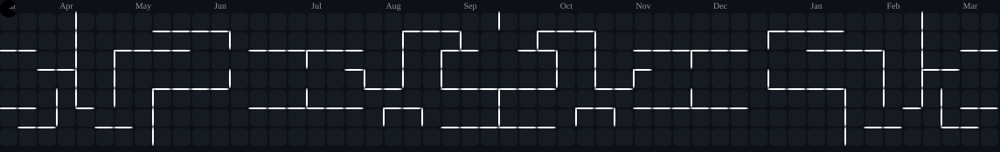

<!-- README.md -->

  

 

  
HUMCOD3R

  

 

  

    A self-taught developer focused on learning through building. 
    Exploring <b>PHP</b>, <b>Node.js</b>, and <b>Python</b> to understand the logic behind every line of code. 
    Still learning, still improving — one project at a time.
  

---

  <h3>Tech Stack</h3>
  

---

### Currently Learning
- PHP – backend logic and clean structure  
- Node.js – APIs and asynchronous scripting  
- Python – automation and practical programming  

---

### Goals
- Improve code quality and structure  
- Build simple yet meaningful tools  
- Learn consistently and stay humble  

---

  <i>"Progress isn't about speed — it's about direction."</i>

 

  

